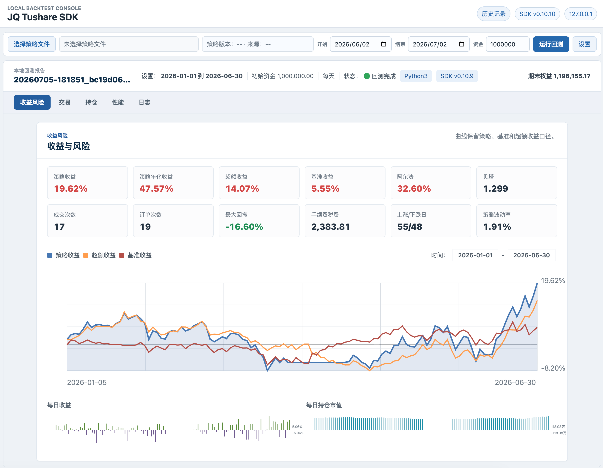

# JQ Tushare SDK

JQ Tushare SDK 是一个本地回测运行时，用 Tushare 数据和本地缓存模拟常用的 JoinQuant/聚宽策略 API。目标是在尽量不修改原策略代码的前提下，把依赖 SaaS 平台的日频 A 股策略放到本地运行、调试和生成报告。

> 本项目不是 JoinQuant/聚宽或 Tushare 官方项目。当前实现覆盖常见日频回测路径，不是完整 API 复刻。

## Features

- 兼容常用聚宽风格 API，例如 `get_price`、`get_fundamentals`、`get_index_stocks`、`order_target_value`、`run_daily`。
- 使用 Tushare 作为数据源，并缓存到项目内 SQLite 数据库。
- 支持本地数据就绪检查；运行回测时会在本地缓存缺口明确且已配置 token 的情况下自动补齐数据。
- 支持订单、成交、持仓、手续费、每日收益和日志输出。
- 每次回测写入独立目录，便于保留和对比多次结果。
- 生成接近聚宽回测风格的 HTML 报告。
- 默认启用透明数据层优化，批量构造当前数据快照以减少重复查询。
- 提供本地 Web 控制台，可选择策略、设置资金和日期、运行回测并查看历史报告。

## Installation

建议使用 Python 3.11 或更新版本。

```bash
git clone <repo-url>
cd <repo>

python -m venv .venv
source .venv/bin/activate

pip install --upgrade pip
pip install -e .
```

更新 Tushare 数据缓存时需要配置 token：

```bash
export TUSHARE_TOKEN="<your-tushare-token>"
```

如果只使用已经准备好的本地缓存，可以不配置 token。

## Prepare Data

推荐把缓存放在项目内，例如 `data/jq_tushare_cache.db`。缓存文件不应提交到 Git。

```bash
python -m jq_tushare_sdk.cli update-data \
  --start <START_DATE> \
  --end <END_DATE> \
  --cache-db data/jq_tushare_cache.db
```

也可以只更新指定数据表：

```bash
python -m jq_tushare_sdk.cli update-data \
  --api daily \
  --api daily_basic \
  --start <START_DATE> \
  --end <END_DATE> \
  --cache-db data/jq_tushare_cache.db
```

常用缓存表包括：

- `trade_cal`
- `daily`
- `fund_daily`
- `daily_basic`
- `adj_factor`
- `stock_basic`
- `index_daily`
- `index_weight`
- `income`

## Check Data

如需单独诊断，可在运行回测前检查本地缓存是否齐备：

```bash
python -m jq_tushare_sdk.cli check-data \
  path/to/strategy.py \
  --start <START_DATE> \
  --end <END_DATE> \
  --cache-db data/jq_tushare_cache.db
```

检查通过时会输出：

```text
Data readiness check passed
```

如果缺数据，命令会输出缺失的数据表和建议执行的补数命令。`check-data` 只做诊断，不会写入缓存；`backtest` 和 Web 控制台运行回测时会先尝试自动补齐这些缺口。

## Run Backtest

```bash
python -m jq_tushare_sdk.cli backtest \
  path/to/strategy.py \
  --start <START_DATE> \
  --end <END_DATE> \
  --cash 1000000 \
  --cache-db data/jq_tushare_cache.db \
  --output-dir backtest_runs
```

运行回测前会先检查本地缓存；如发现可定位的缺口，会使用 `TUSHARE_TOKEN` 自动补齐并复查，复查仍失败时才停止回测并输出原因。检查会识别策略中静态可推断的 `get_price(count=...)`、`attribute_history(..., count)` 和 `history(count, ...)` 历史窗口，并为 ETF/基金价格和基准指数补齐回测开始日前的必要 lookback。

`get_fundamentals(..., statDate=...)` 读取 `income` 财务数据时会按查询日过滤 `ann_date` / `f_ann_date`，避免使用未来才披露的报表；如果请求季度在查询日尚无可见数据，会自动回退到前一个已披露且无未来数据的季度。

`get_index_stocks(...)` 依赖的 `index_weight` 会在缺少回测起始日前成分股快照时向前回溯补数，避免月度权重第一条记录晚于回测起点导致本地检查失败。

默认会启用数据层优化，不改变策略回调顺序。需要做性能对照时可以关闭：

```bash
python -m jq_tushare_sdk.cli backtest \
  path/to/strategy.py \
  --start <START_DATE> \
  --end <END_DATE> \
  --cash 1000000 \
  --cache-db data/jq_tushare_cache.db \
  --no-optimize-data
```

回测完成后会输出本次结果目录：

```text
Backtest complete: backtest_runs/<run_id>
```

## Baseline Template

项目内提供一份最小可运行基线模板，便于团队使用同一份策略程序对齐调仓结果和本地 Tushare 缓存口径：

```text
examples/joinquant_dual_ma_momentum_baseline.py
```

双均线动量模板只依赖常见 `jqdata` API，默认使用多 ETF 池、20/60 日均线和每周调仓，按动量排名最多持有 2 只 ETF；已在目标池中的持仓不会反复按金额微调，适合作为聚宽与本地 SDK 对齐数据、调仓日期和成交路径的基线程序。需要做本地 SDK 对齐时，先用同一回测区间和基准在聚宽端运行，再对比本地报告中的持仓、收益曲线和日志输出。

下图是双均线动量基线在本地 Web 控制台生成的回测报告示例：



## Web Console

如果希望用浏览器操作，也可以启动本地 Web 控制台：

```bash
python -m jq_tushare_sdk.cli web \
  --project-root . \
  --cache-db data/jq_tushare_cache.db \
  --output-dir backtest_runs \
  --host 127.0.0.1 \
  --port 8790
```

然后访问：

```text
http://127.0.0.1:8790/
```

Web 控制台提供：

- 顶部快速回测栏，可选择策略文件、设置初始资金、开始日期和结束日期。
- “设置”面板用于调整缓存数据库、结果目录和数据层优化开关。
- 本地缓存数据检查。
- 历史报告刷新，可在补齐基准指数缓存后重新计算基准收益、超额收益、Alpha 和 Beta。
- 失败任务会直接显示错误摘要，并可展开查看完整异常和补数建议。
- 首页只显示运行中或失败的后台任务，完成的回测进入历史记录页，避免挤占报告阅读区。
- 主页面直接显示选中的 HTML 回测报告。
- 独立历史记录页，可搜索历史回测并跳回主报告页查看。

策略文件选择使用浏览器文件弹窗。由于浏览器不会把本机绝对路径暴露给本地服务，Web 控制台会把选中的 `.py` 文件复制到项目内 `.jqts_web/strategies/` 后再运行；原始策略文件不会被修改。CLI 调用方式仍然直接使用命令行传入的策略路径。上传后界面会显示策略 `VERSION`、来源和文件 Hash；如果当前选择的是旧上传快照，且项目中存在同名更新策略，运行前会提示并改用项目原文件。

Web 控制台只绑定本地地址时不会对外提供服务；如需改成其他监听地址，请自行确认网络和权限边界。

## Results

每次回测都会生成独立目录，典型结构如下：

```text
backtest_runs/<run_id>/
  config.json
  manifest.json
  logs/backtest.log
  trades/orders.csv
  trades/transactions.csv
  reports/performance.csv
  reports/summary.json
  reports/report.html
  signals/*.jsonl
  artifacts/records.jsonl
```

打开 HTML 报告：

```bash
open backtest_runs/<run_id>/reports/report.html
```

如果历史报告中出现“未实现”的基准相关指标，通常是本地缓存缺少策略设置的基准指数 `index_daily` 数据。先补齐对应指数，再刷新已有报告即可，不需要重新运行策略：

```bash
python -m jq_tushare_sdk.cli update-data \
  --api index_daily \
  --start YYYY-MM-DD \
  --end YYYY-MM-DD \
  --cache-db data/jq_tushare_cache.db \
  --ts-code 000985.SH

python -m jq_tushare_sdk.cli refresh-report \
  backtest_runs/<run_id> \
  --cache-db data/jq_tushare_cache.db
```

Web 控制台中也可以选择历史记录后点击“刷新报告”。

也可以启动本地静态服务查看：

```bash
cd backtest_runs/<run_id>/reports
python -m http.server 8787 --bind 127.0.0.1
```

然后访问：

```text
http://127.0.0.1:8787/report.html
```

## Compatibility

当前重点支持日频 A 股策略的本地研究和回测，已覆盖的核心能力包括：

- 策略生命周期：`initialize`、`run_daily`、`run_weekly`、`run_monthly`
- 行情数据：`get_price`、`attribute_history`、`history`
- 基本面数据：`get_fundamentals`、`get_fundamentals_continuously`
- 标的查询：`get_index_stocks`、`get_all_securities`、`get_security_info`、`get_current_data`、`get_industry`
- 查询对象：`query`、`valuation`、`income`
- 交易接口：`order`、`order_value`、`order_target`、`order_target_value`
- 交易成本与滑点：支持 `OrderCost(..., close_today_commission=0)`、`PriceRelatedSlippage` 和 `FixedSlippage`
- 输出结果：日志、订单、成交、每日收益、HTML 报告

主要限制：

- 不覆盖聚宽全部 API。
- 不默认支持完整分钟级撮合。
- 不连接实盘交易系统。
- 数据口径依赖本地 Tushare 缓存，可能与平台回测结果存在差异；历史回测会补齐 `stock_basic` 的上市与退市状态，避免只用当前上市列表造成元数据缺口。
- 前复权行情依赖本地 `adj_factor` 缓存，缺失时会回退到原始行情。

## Versioning

当前版本：`v0.10.17`

版本号遵循 Semantic Versioning：

- `MAJOR`：不兼容的 API 或行为变更。
- `MINOR`：向后兼容的新功能。
- `PATCH`：向后兼容的问题修复、文档修正或内部改进。

版本信息同步维护在：

- `VERSION`
- `jq_tushare_sdk.__version__`
- `pyproject.toml`
- `README.md`
- `CHANGELOG.md`

更新版本时使用脚本统一修改，避免漏改：

```bash
python scripts/bump_version.py patch -m "Describe the user-visible change"
python scripts/bump_version.py minor -m "Describe the new compatible feature"
python scripts/bump_version.py major -m "Describe the breaking change"
```

每次发布前应确认 `CHANGELOG.md` 已写清楚版本变更。

## Tests

```bash
python -m unittest discover -s tests -p "test_*.py"
```

## Security

不要提交以下内容：

- Tushare token 或任何密钥
- 本地数据库缓存
- 回测输出目录
- `.jqts_web/` Web 控制台临时策略副本
- `experiments/` 本地实验目录和个人策略
- `examples/private/`、`strategies/` 等私有策略目录
- 大型日志、临时 CSV、下载文件

建议通过环境变量传入 token，不要把 token 写进代码或配置文件。个人实验策略应放在 `experiments/`、`examples/private/` 或仓库外目录；这些路径默认不会提交或发布。
